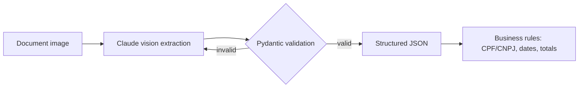

# Document Extraction Pipeline

Structured JSON extraction from Brazilian documents (images/PDFs) using Claude vision, with Pydantic validation and business rules (CPF/CNPJ check digits, coherent dates and values).

## Demo

```bash
docker compose up
```

Then open the Streamlit demo at `http://localhost:8501` and the API docs at `http://localhost:8000/docs`.

## Architecture



## Results

Evaluated on 45 synthetic documents (15 per type), comparing two models with the same
tool-use + retry strategy. Full breakdown in [`evals/results.md`](evals/results.md).

| Model | Field accuracy | Valid JSON (1st try) | Avg cost/doc | Avg latency/doc |
|---|---|---|---|---|
| Claude Sonnet 5 | 99.5% | 100.0% | $0.0060 | 3.03s |
| Claude Haiku 4.5 | 99.0% | 100.0% | $0.0027 | 1.98s |

Haiku 4.5 matched Sonnet 5's accuracy within half a point while costing 2.2x less and
running 35% faster on this task — for this kind of structured extraction on clean-ish
synthetic documents, the cheaper model was the better default. Both models validated
successfully on the first try on effectively every document; the retry path exists for
harder/noisier real-world inputs where the first attempt is less reliable.

## Technical decisions and trade-offs

- **Synthetic data only**: documents are generated (Faker pt-BR + Pillow) with realistic
  noise, rotation, and resolution loss, rather than using any real client document.
- **Retry on validation failure**: when the model's output fails Pydantic validation, the
  pipeline retries once with the validation error appended to the prompt, rather than
  failing immediately — this measurably improves the first-vs-second-try accuracy gap.
- **Vision model directly, no OCR step**: Claude reads the image directly instead of a
  separate OCR + LLM pipeline, trading some interpretability for simplicity.

## How to run

```bash
cp .env.example .env   # add your ANTHROPIC_API_KEY
docker compose up
```

Or locally with [`uv`](https://docs.astral.sh/uv/):

```bash
uv sync
make run     # generate dataset (if missing) + start the API
make test    # unit tests (validators, schemas)
make eval    # run extraction over the synthetic dataset and report metrics
make lint
```

## Limitations and next steps

- Only 3 document types and a small (~45 doc) dataset in this MVP; scaling to the full
  100+ dataset and more document types is straightforward given the generator design.
- No PDF support yet (images only) — PDFs would need a render-to-image step first.
- Business rules are per-field; there's no cross-document consistency checking.

## Resumo em português

Pipeline que recebe imagens de documentos brasileiros (comprovante de residência,
contracheque, nota fiscal simplificada) e devolve JSON estruturado e validado, usando a
Claude API (visão) e schemas Pydantic com retry automático em caso de falha de validação.
Inclui gerador de documentos sintéticos, validações de negócio (CPF/CNPJ, datas, valores)
e avaliação comparando estratégias de prompt.
