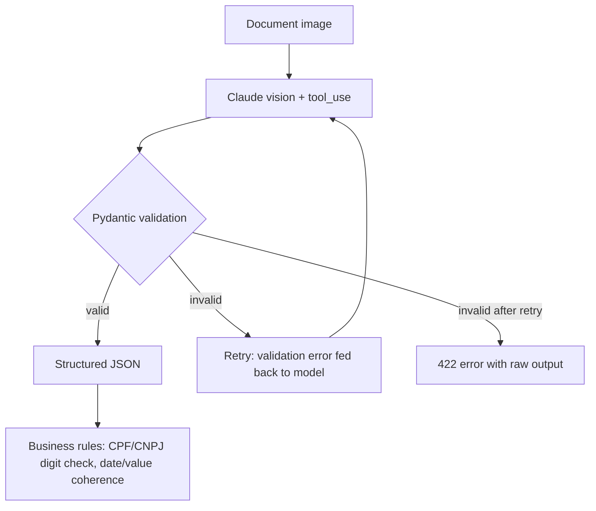

# Architecture

The extraction schema is generated from the same Pydantic model used for validation
(`model_json_schema()`), so the tool definition sent to Claude and the validator that
checks its output can never drift apart.
